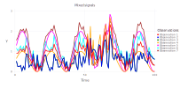

# Blind Source Separation using Unsupervised Machine Learning

[MADS](http://madsjulia.github.io/Mads.jl is applied to perform Unsupervised Machine Learning and extract (separate) mixed signals (signautes) present in synthetic datasets.

Frequently, there are several different physical phenomena, processes, or mechanisms that may can cause different transients in the observed data. There transients may have different spatiotemporal patterns.

The discovery of the hidden (latent) signatures (sources/signals) caused by the underlaying physical processes can be challenging.

For example, in the case of water-level (hydraulic pressure) data, these might be barometric pressure fluctuations, tidal effects, pumping effects, etc.
In the case of geochemical contamination problems, these may represent a mixture of different groundwater types (contaminant sources) with different initial geochemical compositions.

The separation of the different signals observed in the data is important for many tasks including site characterization, model conceptualization and setup.

Below a series of synthetic examples are presented how transient data can be used to identify (separate/unmix) the original signals.

More complicated Blind Source Separation (BSS) analyses can be found in our papers (see references below).

All the analyses presented below using [`examples/blind_source_separation.jl`](https://github.com/madsjulia/Mads.jl/blob/master/examples/blind_source_separation/blind_source_separation.jl).

See also the related [Jupyter notebook](https://github.com/madsjulia/Mads.jl/blob/master/notebooks/blind_source_separation/blind_source_separation.ipynb).

## Synthetic Sources (Case 1)

Here, synthetic sources are generated using sine functions and random noise

### Original signals (assumed unknown)

Let us assume there are 3 unknown sources (physical processes/phenomena) causing transients in some observable state variable.
Let us assume the transients (signals) associated with these 3 unknown sources look like this:

### Mixed signals observed at 4 different monitoring locations (representing 4 different observation streams)

Let us assume that the transients of the original unknown sources are observed as a mixture at 4 different monitoring locations (observation points).
Let us assume that the mixtures looks like this:

### Reconstructed (unmixed) original signals (sources) based on the observed data

We want to find the original unknown signals (sources) based on the observed mixtures above.
BSS method in MADS allow us to do this.
From the mixture at the 4 monitoring locations (observation points), we can reconstruct (unmix) original signals (sources) almost perfectly:

## Synthetic Sources (Case 2)

Now, synthetic sources are generated using sine functions and random noise representing a disturbance of normal pace of life.

### Original sources (assumed unknown)

### Mixed sources observed at 7 different observation points

### Reconstructed (unmixed) original signals based on the observed data

## Synthetic Sources (Case 3)

Now, synthetic sources are generated using just sine functions.

### Original sources (assumed unknown)

### Mixed sources observed at 4 different observation points

### Reconstructed (unmixed) original signals based on the observed data

## Synthetic Sources (Case 4)

Now, synthetic sources are generated using random noise.

### Original signals (assumed unknown)

### Mixed signals observed at 4 different observation points

### Reconstructed (unmixed) original signals based on the observed data

## References

- Alexandrov, B.S., Vesselinov, V.V., Blind source separation for groundwater pressure analysis based on nonnegative matrix factorization. Water Resources Research, 0.1002/2013WR015037,  2014. [PDF](https://gitlab.com/monty/monty.gitlab.io/raw/master/papers/Alexandrov%20&%20Vesselinov%202014%20Blind%20source%20separation%20for%20groundwater%20pressure%20analysis%20based%20on%20nonnegative%20matrix%20factorization.pdf)
- Vesselinov, V.V., Alexandrov, B.S., O'Malley, D., Nonnegative Tensor Factorization for Contaminant Source Identification, Journal of Contaminant Hydrology, 10.1016/j.jconhyd.2018.11.010, 2018. [PDF](http://monty.gitlab.io/papers/Vesselinov et al 2018 Nonnegative Tensor Factorization for Contaminant Source Identification.pdf)
- Iliev, F.L., Stanev, V.G., Vesselinov, V.V., Alexandrov, B.S., Nonnegative Matrix Factorization for identification of unknown number of sources emitting delayed signals, PLoS ONE, 10.1371/journal.pone.0193974. 2018. [PDF](http://monty.gitlab.io/papers/Iliev et al 2018 Nonnegative Matrix Factorization for identification of unknown number of sources emitting delayed signals.pdf)
- Stanev, V.G., Iliev, F.L., Hansen, S.K., Vesselinov, V.V., Alexandrov, B.S., Identification of the release sources in advection-diffusion system by machine learning combined with Green function inverse method, Applied Mathematical Modelling, 10.1016/j.apm.2018.03.006, 2018. [PDF](http://monty.gitlab.io/papers/Stanev et al 2018 Identification of release sources in advection-diffusion system by machine learning combined with Green's function inverse method.pdf)
- Vesselinov, V.V., O'Malley, D., Alexandrov, B.S., Contaminant source identification using semi-supervised machine learning, Journal of Contaminant Hydrology, 10.1016/j.jconhyd.2017.11.002, 2017. [PDF](http://monty.gitlab.io/papers/Vesselinov 2017 Contaminant source identification using semi-supervised machine learning.pdf)