## Information Gap Analysis

All the figures below are generated using `examples/model_analysis/infogap.jl`.

### Setup

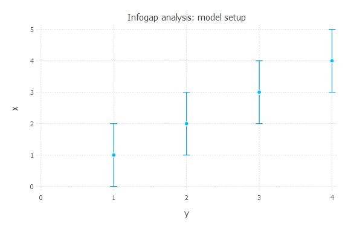

* There are 4 uncertain observations at times t = [1,2,3,4]

* There are 4 possible models that can be applied to match the data

    1. `y(t) = a * t + c`

    2. `y(t) = a * t^(1.1) + b * t + c`

    3. `y(t) = a * t^n + b * t + c`

    4. `y(t) = a * exp(t * n) + b * t + c`

* There are 4 unknown model parameters with uniform prior probability functions:

    1. `a = Uniform(-10, 10)`

    2. `b = Uniform(-10, 10)`

    3. `c = Uniform(-5, 5)`

    4. `n = Uniform(-3, 3)`

* The model prediction for t = 5 is unknown and information gap prediction uncertainty needs to be evaluated

* The horizon of information gap uncertainty `h` is applied to define the acceptable deviations in the 4 uncertain observations.

### Infogap in model `y(t) = a * t + c`

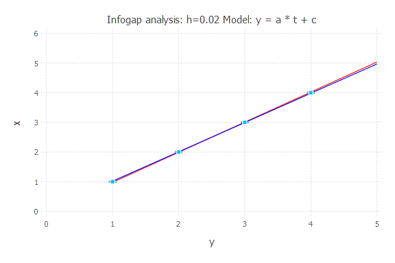

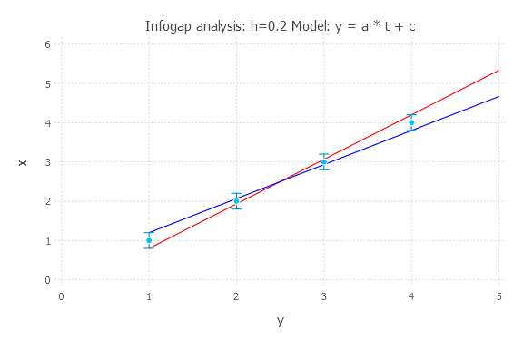

### Infogap in model `y(t) = a * t^(1.1) + b * t + c`

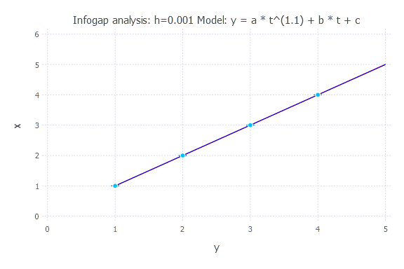

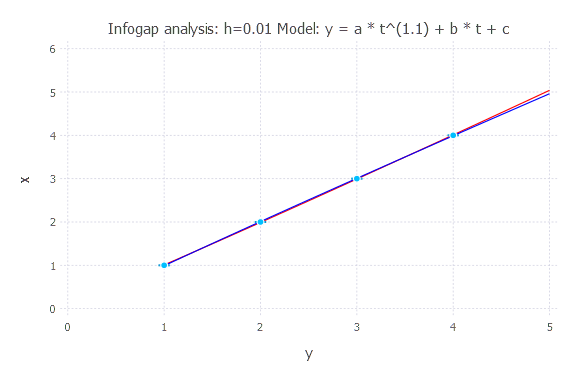

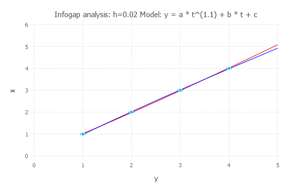

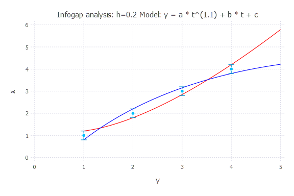

### Infogap in model `y(t) = a * t^n + b * t + c`

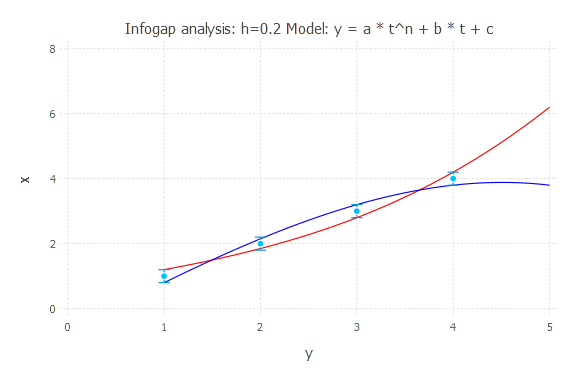

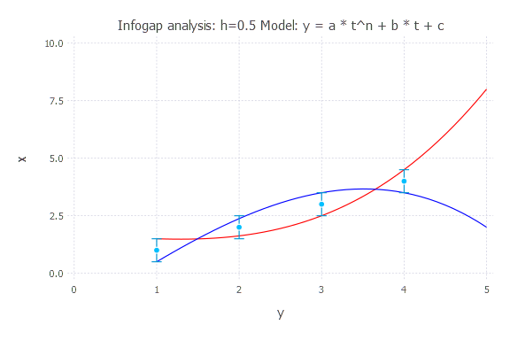

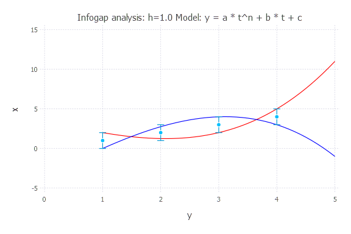

### Infogap in model `y(t) = a * exp(t * n) + b * t + c`

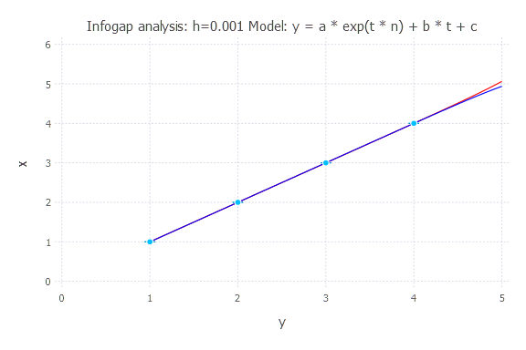

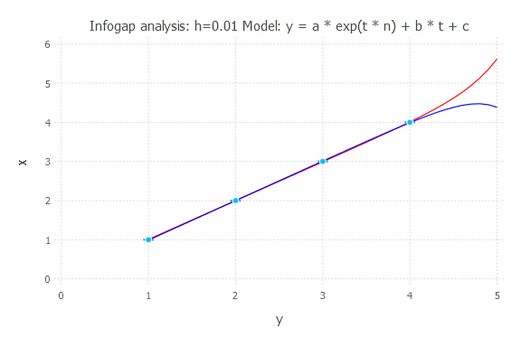

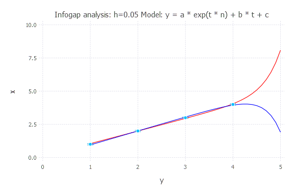

### Opportuneness and Robustness of the 4 models

