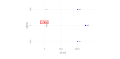
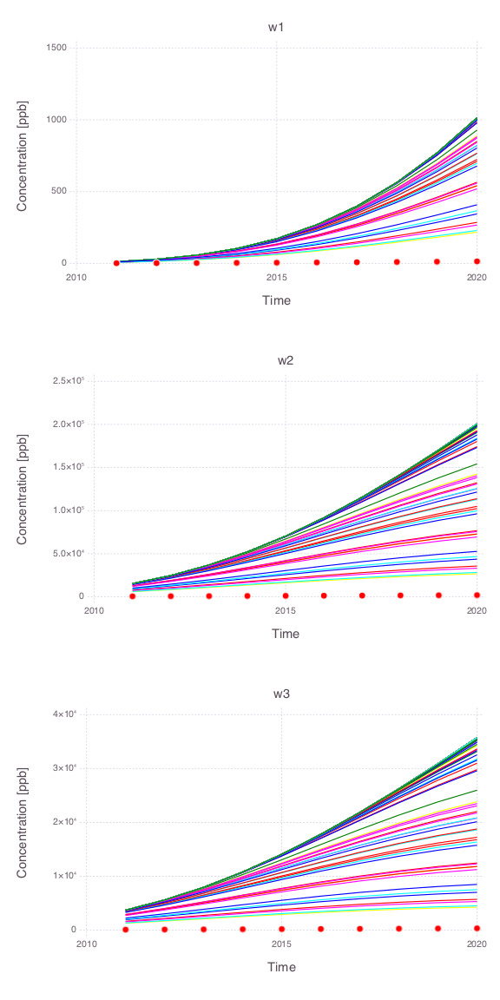
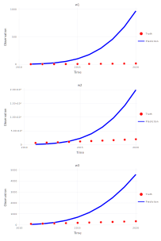
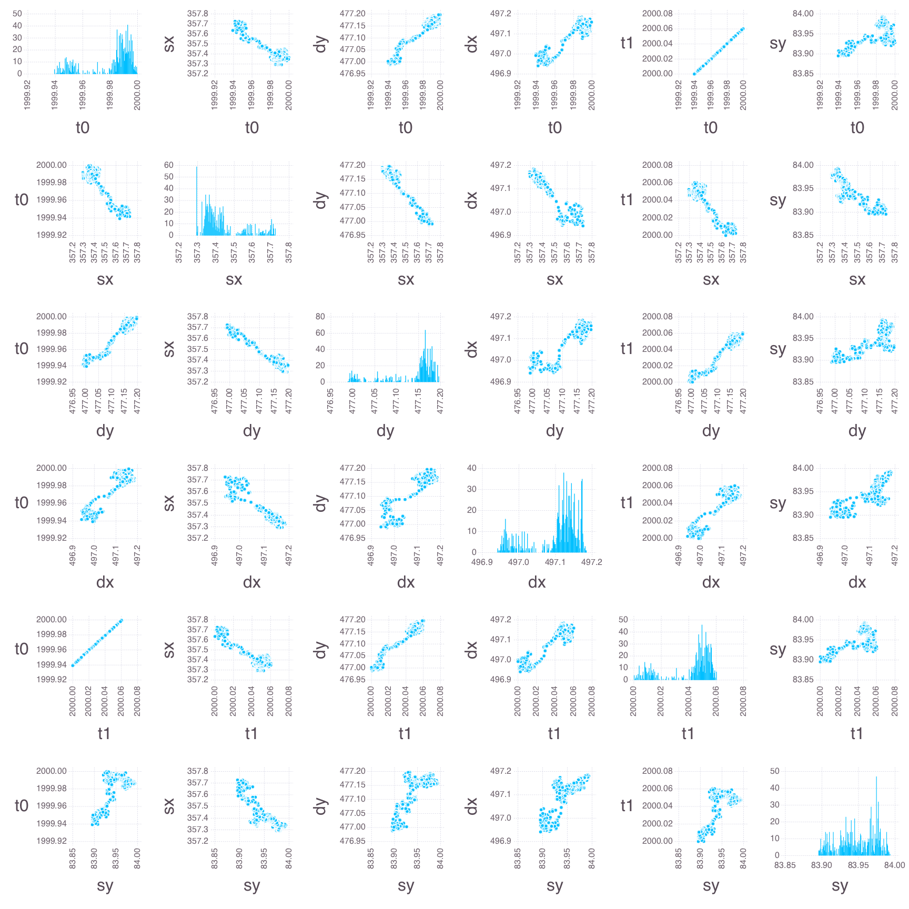

## Bayesian Sampling

All the figures below are generated using `examples/bayesian_sampling/bayesian_sampling.jl`.

### Model setup

* Contaminant source (orange rectangle)

* 3 monitoring wells

### Prior spaghetti plots

Spaghetti plots of 100 model runs representing the prior model prediction uncertainties at the 3 monitoring wells.

#### Joint spaghetti plots

All model parameters are changed simultaneously within their prior uncertainty ranges.

#### Individual spaghetti plots

A single model parameter is changed at a time.

**Source $x$ location**

**Source $y$ location**

**Source size along $x$ axis**

**Source size along $y$ axis**

**Source release time $t_0$**

**Source termination time $t_1$**

### Model calibration match

### Bayesian sampling results

### Posterior spaghetti plots

Spaghetti plots of 1000 model predictions representing the posterior model uncertainties at the 3 monitoring wells.

#### Joint spaghetti plots

All model parameters are changed simultaneously within their prior uncertainty ranges.

#### Individual spaghetti plots

A single model parameter is changed at a time.

Note that only the posterior uncertainties in the source release time ($t_0$)  and the source termination time ($t_1$) are producing large impact in the model predictions.

**Source $x$ location (all the 1000 model predictions are overlapping)**

**Source $y$ location (all the 1000 model predictions are overlapping**

**Source size along $x$ axis (all the 1000 model predictions are overlapping**

**Source size along $y$ axis (all the 1000 model predictions are overlapping**

**Source release time $t_0$**

**Source termination time $t_1$**

