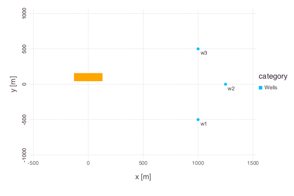
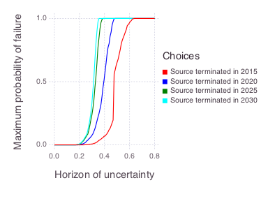
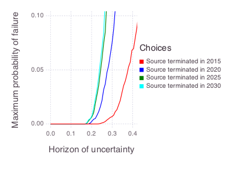

# Bayesian Information Gap Decision Theory: Contaminant Source Termination

This example compares contaminant source-termination decisions under probabilistic parameter uncertainty and non-probabilistic model uncertainty.

The years describe a historical hypothetical analysis whose decision baseline is 2015; they are not current-date recommendations.

The figures are generated by [`source_termination.jl`](./source_termination.jl).

The same workflow is available as an interactive [EnviCloud decision-support demo](https://cloud.envitrace.com/demos/decision-support).

## Model setup



- The orange rectangle represents the contaminant source.
- The three points represent monitoring wells W1, W2, and W3.

The source location, shape, strength, and release start time are treated as known in this example.

Concentrations were observed annually at the three monitoring wells from 2006 through 2015.

The uncertain model parameters are groundwater flow velocity and longitudinal plume dispersivity.

Inverse modeling uses the observations to constrain these parameters, but the resulting estimates remain uncertain.

BIG-DT carries those probabilistic uncertainties into a decision analysis and also examines outcomes outside the nominal model assumptions.

## Uncertainties

### Probabilistic uncertainties

- Prior probability distributions describe groundwater flow velocity and longitudinal plume dispersivity before calibration.
- Measurement discrepancies are represented by a quadratic Gaussian-style log-likelihood.
- Posterior parameter distributions account for how the observed concentrations constrain the prior distributions.

The observation weight is `0.001` in the Mads problem file.

Within this example's quadratic log-likelihood, that weight corresponds to a nominal variance of 500 and a nominal standard deviation of approximately 22.4.

### Non-probabilistic uncertainties

- A relative prediction envelope allows actual W2 concentrations to differ from nominal model predictions.
- A family of likelihood weights allows the assumed discrepancy variance to differ from its nominal value.

The current implementation varies the relative prediction envelope and likelihood variance; it does not sample arbitrary residual distribution shapes.

## Decision goal

Keep modeled concentrations at monitoring well W2 below the example's site performance goal of 8,000 ppb from 2016 through 2035.

## Decision scenarios

The hypothetical decision baseline is 2015.

- Terminate the source immediately in 2015.
- Terminate the source after five years in 2020.
- Terminate the source after ten years in 2025.
- Terminate the source after fifteen years in 2030.

The task is to evaluate how robustly each schedule keeps future W2 concentrations below the decision threshold under the modeled uncertainties.

## Method

Bayesian Information Gap Decision Theory combines Bayesian parameter inference with an information-gap horizon that expands the set of plausible model outcomes and likelihood variances.

For a horizon $h$, the likelihood variance can vary within

```math
\left\{\sigma^2 : \frac{\sigma_0^2}{10^h} \leq \sigma^2 \leq 10^h\sigma_0^2\right\}.
```

Here, $\sigma_0^2$ is the nominal variance and $h$ is a non-negative uncertainty horizon.

The prediction envelope also permits relative deviations up to the selected horizon around each nominal W2 concentration.

Larger horizons therefore admit a broader set of possible outcomes.

## Robustness

For a selected acceptable probability of failure, robustness is the uncertainty horizon at which the worst-case probability of violating any performance goal first reaches that probability.

The example uses an acceptable failure probability of 0.05 by default.

A larger robustness horizon means that a decision tolerates more uncertainty before it reaches the selected failure probability.

If the failure probability is not reached within the tested horizon range, the decision summary reports the robustness horizon as unavailable and marks the result as not reached.

## Results

The complete robustness curves show the full modeled probability range.



The zoomed view emphasizes the region near the default 5% acceptable probability of failure.



At the nominal horizon, all four schedules have a low modeled probability of exceeding the W2 performance goal.

The probability of failure rises as the uncertainty horizon expands.

Earlier termination generally provides a larger robustness horizon, while the 2025 and 2030 schedules are closer to one another in this example.

The result does not identify one universally correct action because implementation cost, exposure duration, and decision-maker risk tolerance are not included in the robustness ranking.

Those considerations should be evaluated alongside the BIG-DT curves.

## Model

Mads evaluates an analytical solution for contaminant transport with Fickian dispersion.

The source has a Gaussian spatial shape, and its release begins in 1985.

The rectangle dimensions in the setup figure represent the source standard deviations along the horizontal axes.

## Reproducible execution

The standard script uses 1,000 parameter samples per decision scenario, 100 uncertainty horizons, five sampled likelihood variants, and a fixed random seed.

This represents roughly 4,000 unique scenario-sample combinations.

The current likelihood-weighting implementation can re-evaluate a combination for multiple likelihood variants, so the actual number of forward model calls is higher.

Runtime depends on the Julia environment and available parallel workers; the former fixed five-minute estimate is therefore not portable.

Use the quick configuration in [`README.md`](./README.md) for interface development and use the standard configuration for final comparisons.

## References

- O'Malley, D., and V. V. Vesselinov, [Bayesian-information-gap decision theory with an application to CO2 sequestration](https://doi.org/10.1002/2015WR017413), *Water Resources Research* 51.9 (2015): 7080-7089.
- Grasinger, M., et al., [Decision analysis for robust CO2 injection: Application of Bayesian-Information-Gap Decision Theory](https://doi.org/10.1016/j.ijggc.2016.02.017), *International Journal of Greenhouse Gas Control* 49 (2016): 73-80.
- O'Malley, D., and V. V. Vesselinov, [A combined probabilistic/nonprobabilistic decision analysis for contaminant remediation](https://doi.org/10.1137/140965132), *SIAM/ASA Journal on Uncertainty Quantification* 2.1 (2014): 607-621.
- O'Malley, D., and V. V. Vesselinov, [Groundwater remediation using the information gap decision theory](https://doi.org/10.1002/2013WR014718), *Water Resources Research* 50.1 (2014): 246-256.
