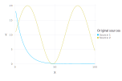
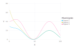
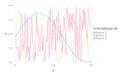
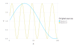
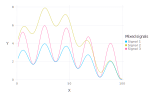
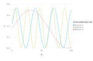
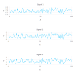
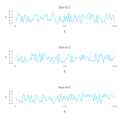

## Blind Source Separation

Frequently there are several different physical phenomena or mechanisms (sources) than may can cause transients in the observed data.

For example, in the case of water-level (hydraulic pressure) data, these might me barometric pressure fluctuations, tidal effects, pumping effects, etc.
In the case of geochemical concentrations, these may represent a mixture of different groundwater sources with different initial geochemical compositions.

The separation of the different signals observed in the data is important for conceptualization of the site conditions.

Below a series of synthetic examples are presented how transient data can be used to identify (separate/unmix) the original signals.

More complicated Blind Source Separation (BSS) analyses can be found in:

Alexandrov, Boian S., and Velimir V. Vesselinov. "Blind source separation for groundwater pressure analysis based on nonnegative matrix factorization." Water Resources Research 50.9 (2014): 7332-7347.

All the figures below are generated using `examples/blind_source_separation.jl`. BSS can be performed using different methods. The examples below use the [Ipopt](https://projects.coin-or.org/Ipopt) implementation in the [JuMP](https://github.com/JuliaOpt/JuMP.jl) Julia module.

### Sources generated using sine functions and random noise

#### Original sources (assumed unknown)

#### Mixed sources observed at 4 different monitoring locations (representing 4 different signals or observation streams)

#### Reconstructed (unmixed) original sources based on the observed data

### Sources generated using sine functions

#### Original sources (assumed unknown)

#### Mixed sources observed at 4 different monitoring locations (representing 4 different signals or observation streams)

#### Reconstructed (unmixed) sources based on the observed data

### Sources generated using random noise

#### Original sources (assumed unknown)

#### Mixed sources observed at 4 different monitoring locations (representing 4 different signals or observation streams)

#### Reconstructed (unmixed) original sources based on the observed data

