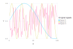
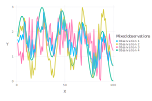
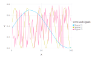
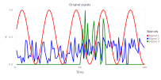
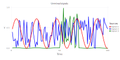
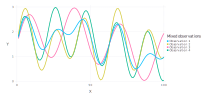
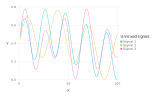
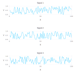
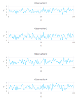
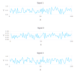

## Blind Source Separation using Unsupervised Machine Learning

Frequently, there are several different physical phenomena or mechanisms (sources/signals) than may can cause transients in the observed data.

For example, in the case of water-level (hydraulic pressure) data, these might be barometric pressure fluctuations, tidal effects, pumping effects, etc.
In the case of geochemical concentrations, these may represent a mixture of different groundwater types (groundwater sources) with different initial geochemical compositions.

The separation of the different signals observed in the data is important for many tasks including model conceptualization and setup.

Below a series of synthetic examples are presented how transient data can be used to identify (separate/unmix) the original signals.

More complicated Blind Source Separation (BSS) analyses can be found in:

Alexandrov, Boian S., and Velimir V. Vesselinov. "Blind source separation for groundwater pressure analysis based on nonnegative matrix factorization." Water Resources Research, [doi: 0.1002/2013WR015037](http://onlinelibrary.wiley.com/doi/10.1002/2013WR015037/abstract), 50.9, 7332-7347, 2014.

All the figures below are generated using `examples/blind_source_separation.jl`. BSS can be performed using different methods.
The examples below use the [Ipopt](https://projects.coin-or.org/Ipopt) implementation in the [JuMP](https://github.com/JuliaOpt/JuMP.jl) Julia module.

### Sources generated using sine functions and random noise

#### Original signals (assumed unknown)

Let us assume there are 3 unknown sources (physical processes/phenomena) causing transients in some observable state variable.
Let us assume the transients (signals) associated with these 3 unknown sources look like this:

#### Mixed signals observed at 4 different monitoring locations (representing 4 different observation streams)

Let us assume that the transients of the original unknown sources are observed as a mixture at 4 different monitoring locations (observation points).
Let us assume that the mixtures looks like this:

#### Reconstructed (unmixed) original signals (sources) based on the observed data

We want to find the original unknown signals (sources) based on the observed mixtures above.
BSS method in MADS allow us to do this.
From the mixture at the 4 monitoring locations (observation points), we can reconstruct (unmix) original signals (sources) almost perfectly:

### Sources generated using sine functions and random noise representing a disturbance of normal pace of life

#### Original sources (assumed unknown)

#### Mixed sources observed at 7 different observation points

#### Reconstructed (unmixed) original signals based on the observed data

### Sources generated using sine functions

#### Original sources (assumed unknown)

#### Mixed sources observed at 4 different observation points

#### Reconstructed (unmixed) original signals based on the observed data

### Sources generated using random noise

#### Original signals (assumed unknown)

#### Mixed signals observed at 4 different observation points

#### Reconstructed (unmixed) original signals based on the observed data

