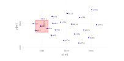
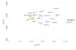
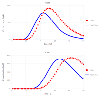
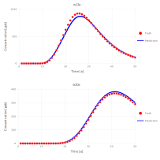
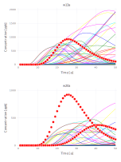
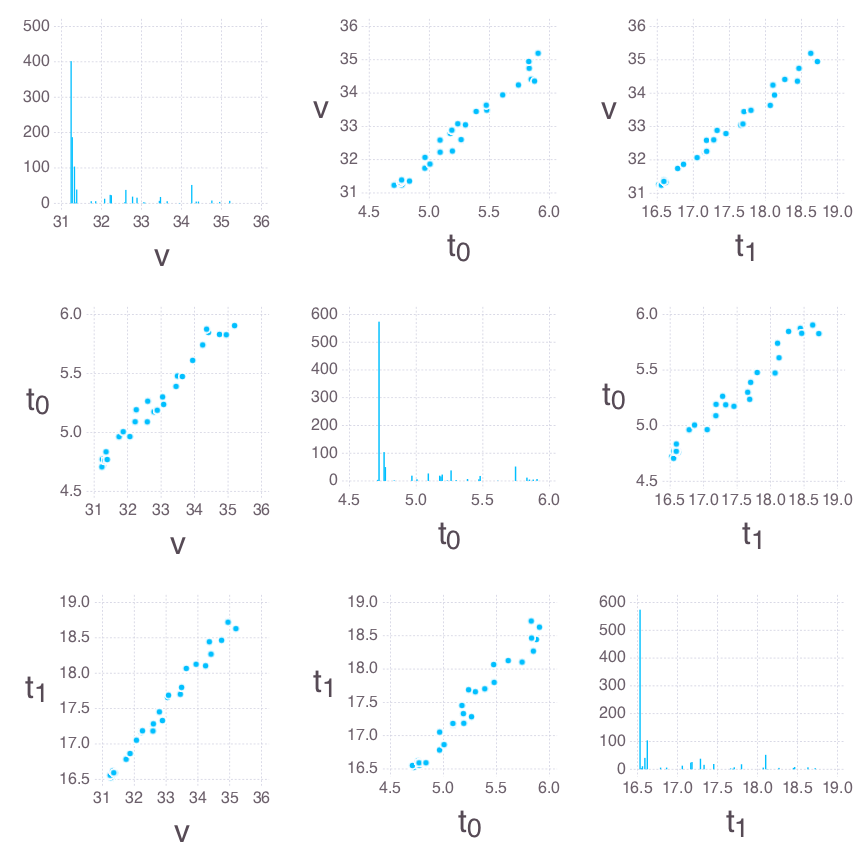
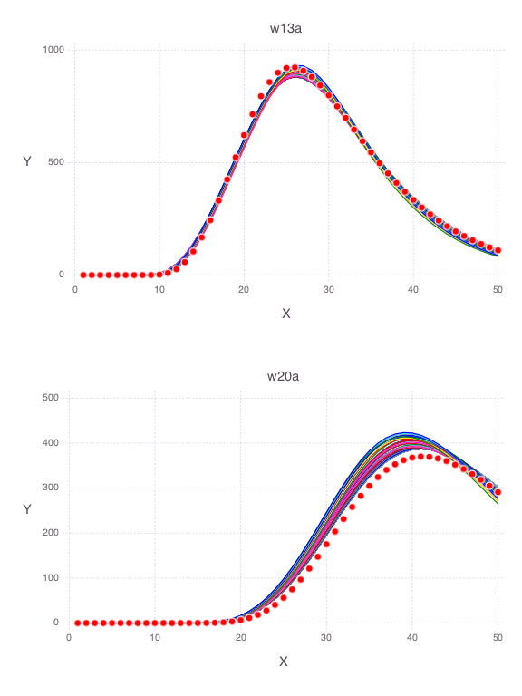
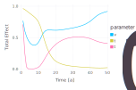

## Analysis of contaminant transport in an aquifer

All the figures below are generated using `examples/contamination/contamination.jl`.

### Model setup

There are 20 monitoring wells.
Each well has 2 measurement ports: shallow (3 m below the water table labeled `a`) and deep (33 m below the water table labeled `b`).
Contaminant concentrations are observed for 50 years at each well.
The contaminant transport is solved using the `Anasol` package in Mads.

### Unknown model parameters

* Start time of contaminant release $t_0$
* End time of contaminant release $t_1$
* Advective pore velocity $v$

### Reduced model setup 

Analysis of the data from only 2 monitoring locations: `w13a` and `w20a`.

### Example model solution

Model parameter values:

* $t_0 = 4$ 
* $t_1 = 15$
* $v = 40$

### Model calibration

A calibration match between observations and model predictions obtained by model inversion:

### Prior parameter uncertainties

Probabilistic distributions of the prior parameter uncertainties are:

* $t_0$ = Uniform(0, 10)
* $t_1$ = Uniform(5, 40)
* $v$ = LogUniform(0.1, 200)

Spaghetti plots representing the prior uncertainties (note that the uncertainties are not constrained by the observed data):

The observation data are plotted as red dots.

### Bayesian global sensitivity analysis

Histograms and scatter plots of the Bayesian MCMC results:

### Posterior parameter uncertainties

Spaghetti plots representing the posterior uncertainties:

Note that the parameter uncertainties are constrained by the observation data.
The observation data are plotted as red dots.

### eFAST global sensitivity analysis

eFAST has proven to be one of the most reliable methods among the existing variance-based techniques for quantification of parameter sensitivity (Saltelli, 2004; Saltelli & Bolado, 1998; Saltelli et al., 2000; Saltelli et al., 1999). 

Total and main sensitivity indices over time for monitoring wells w13a and w20a:

The differences between main and total effect estimates suggest correlations among the parameters.

### Saltelli's global sensitivity analysis

Classical Saltelli's (Sobol's) global sensitivity analysis.

Total and main sensitivity indices over time for monitoring wells w13a and w20a:

There are differences between eFAST & Saltelli estimates. The eFAST results should be considered more reliable.