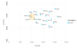
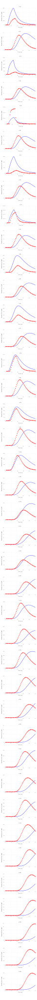

## Contaminant transport in an aquifer

### Model setup



There are 20 monitoring wells.
Each well has 2 measurement ports: shallow (3 m below the water table labelled `a`) and deep (33 m below the water table labelled `b`).
Contaminant concentrations are observed for 50 years at each well.

### Unknown model parameters

* Start Time of contaminant releast `$t_0$`
* Ent Time of contaminant releast `$t_1$`
* Advctive pore velocity `$v$`

### Example model solution


```
$t_0 = 4$
$t_1 = 15$
$v = 40$
```

### Reduced analysis 

Analysis of the data from only 2 monitoring locations: w13a and w20a.

### Calibration match between observations and model predictions



### Local sensitivity analysis


### Gloabal sensitivity analysis


Prior parameter uncertainties:

```
k = LogUniform(0.01, 0.1)
omega = Uniform(0.1, 0.3)
```

### Bayesian sensitivity analysis

#### Observations

Synthetic observations are applied to contrain the ODE parameters


Observation errors are equal for all the sample locations with standard deviation equal to 1 (`observation weight` =  1 / `observation standard deviation` = 1 / 1 = 1)

#### Prior parameter uncertainties


#### Histograms/scatter plots of Bayesian MCMC results


#### Posterior parameter uncertainties

Note: parameter uncertainties are constrained by observation data


