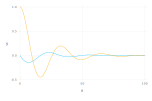
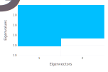
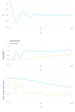

## Analysis of an Ordinary Differential Equation (DOE)

### ODE

$$x''(t) == -\omega^2 * x(t) - k * x'(t)$$

### Unknown ODE parameters

* k
* $\omega$

### An Example ODE solution



```
k = 0.1
$\omega$ = 0.2
```

### Local sensitivity analysis




### Global sensitivity analysis



Prior parameter uncertainties:

```
k = LogUniform(0.01, 0.1)
$\omega$ = Uniform(0.1, 0.3)
```

### Bayesian sensitivity analysis

#### Observations

Synthetic observations are applied to constrain the ODE parameters


Observation errors are equal for all the sample locations with standard deviation equal to 1 (`observation weight` =  1 / `observation standard deviation` = 1 / 1 = 1)

#### Prior parameter uncertainties


#### Histograms/scatter plots of Bayesian MCMC results


#### Posterior parameter uncertainties

Note: parameter uncertainties are constrained by observation data


