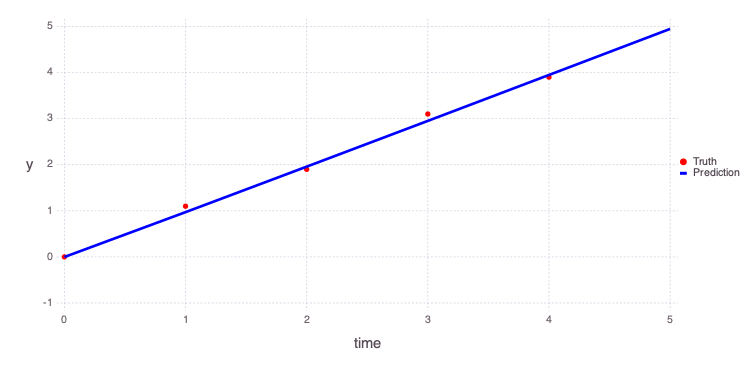
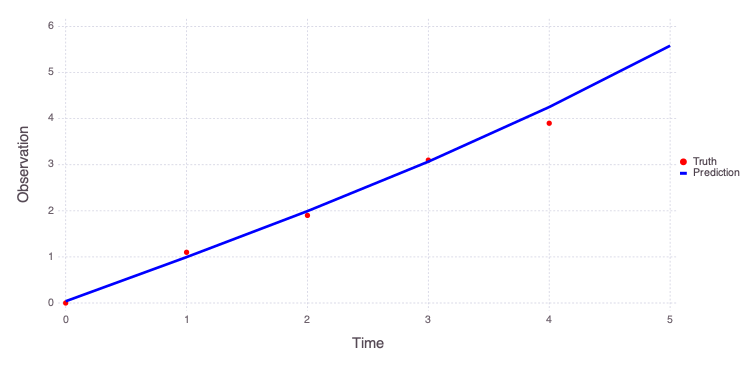
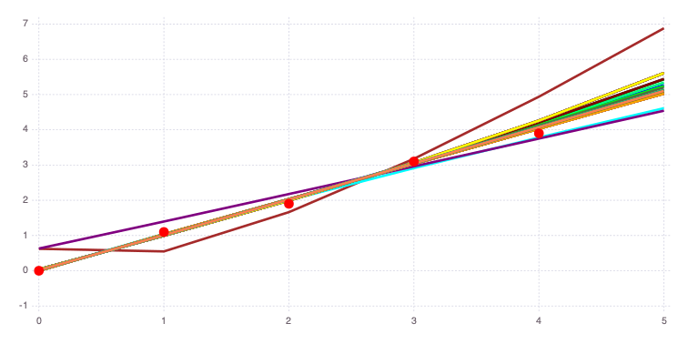
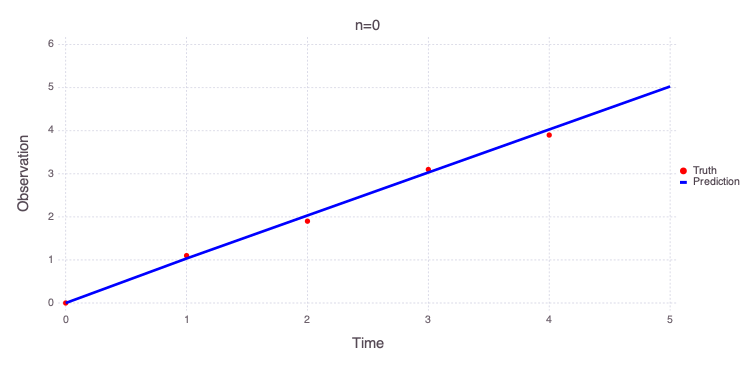
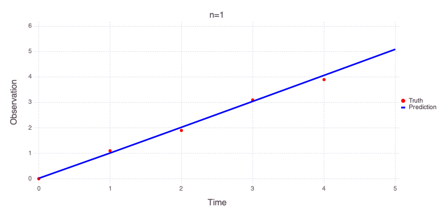
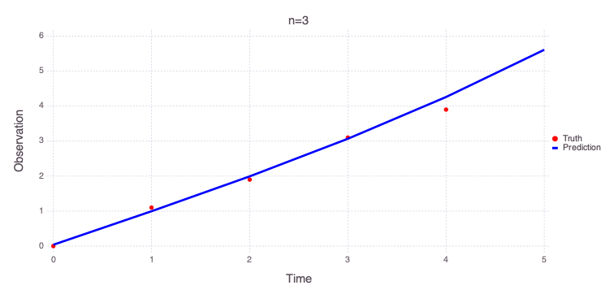
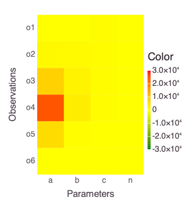
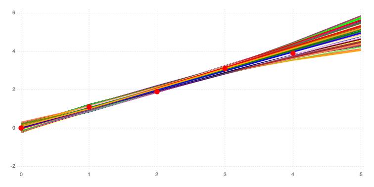
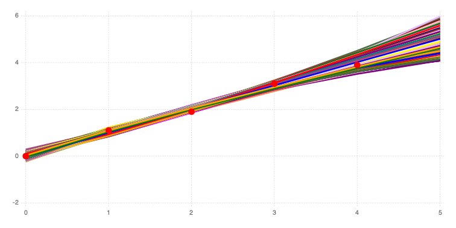

# MADS: Model diagnostics

[MADS](http://madsjulia.github.io/Mads.jl) is an integrated high-performance computational framework for data/model/decision analyses.

<div style="text-align: left; padding-top: 30px; padding-bottom: 30px;">
    
</div>

[MADS](http://madsjulia.github.io/Mads.jl) can be applied to perform:

* Sensitivity Analysis
* Parameter Estimation
* Model Inversion and Calibration
* Uncertainty Quantification
* Model Selection and Model Averaging
* Model Reduction and Surrogate Modeling
* Machine Learning (e.g., Blind Source Separation, Source Identification, Feature Extraction, Matrix / Tensor Factorization, etc.)
* Decision Analysis and Support

Here, it is demonstrated how [MADS](http://madsjulia.github.io/Mads.jl) can be applied to solve a general model diagnostic problem.

Most of the tasks listed above are demonstrated below.

## Problem setup

Import Mads (if **MADS** is not installed, first execute in the Julia REPL:

```julia
import Pkg
Pkg.add("Mads")
Pkg.add("Cairo")
Pkg.add("Fontconfig")
```


```julia
import Mads
import Cairo
import Fontconfig
```

    Mads: Model Analysis & Decision Support
    ====

        ___      ____            ____    ____              ______
       /   \    /    \          /    |  |    \            /  __  \
      |     \  /     |         /     |  |     \          /  /  \__\
      |  |\  \/  /|  |        /      |  |      \        |  |
      |  | \    / |  |       /  /|   |  |   |\  \        \  \______.
      |  |  \__/  |  |      /  / |   |  |   | \  \        \_______  \
      |  |        |  |     /  /  |   |  |   |  \  \               \  \
      |  |        |  |    /  /===|   |  |   |___\  \    __.        |  |
      |  |        |  |   /  /    |   |  |           \   \  \______/  /
      |__|        |__|  /__/     |___|  |____________\   \__________/

    MADS is an integrated high-performance computational framework for data- and model-based analyses.
    MADS can perform: Sensitivity Analysis, Parameter Estimation, Model Inversion and Calibration, Uncertainty Quantification, Model Selection and Model Averaging, Model Reduction and Surrogate Modeling, Machine Learning, Decision Analysis and Support.


Setup the working directory (in this case, the working directory is the location of this notebook):


```julia
cd(joinpath(Mads.dir, "notebooks", "model_diagnostics"))
```

### Setup the model:

A function (called `polynomial`) is defined to compute the 6 observations given the 4 model parameters as an input:


```julia
function polynomial(parameters::AbstractVector{<:Real})::Vector{Float64}
	predictions::Vector{Float64} = [
		Float64(parameters[1] * t^parameters[4] + parameters[2] * t + parameters[3]) for t in 0:5
	]
	return predictions
end
```


    polynomial (generic function with 1 method)


This function will be applied in the model diagnostics analyses presented here.

### Setup the problem dictionary (method #1)

A problem dictionary is applied to store all the information related to the analyzed model.

This includes:
* parameter names (`["a", "b", "c", "n"]`)
* parameter initial guesses (`[1,1,1,1]`)
* parameter prior distributions
* true observation values that we want to reproduce (`[0,1.1,1.9,3.1,3.9,5]`)
* observation distributions (i.e., uncertainty ranges or measurement errors)
* observation weights (`[100,100,100,100,10,0]`)
* observation times (`[0,1,2,3,4,5]`) at which observations are made

The problem dictionary is created as follows:


```julia
md = Mads.createproblem([1,1,1,1], [0,1.1,1.9,3.1,3.9,5], polynomial; paramkey=["a", "b", "c", "n"], paramdist=["Uniform(-10, 10)", "Uniform(-10, 10)", "Uniform(-5, 5)", "Uniform(0, 3)"], obsweight=[100,100,100,100,10,0], obstime=[0,1,2,3,4,5], obsdist=["Uniform(0, 1)", "Uniform(0, 2)", "Uniform(1, 3)", "Uniform(2, 4)", "Uniform(3, 5)", "Uniform(4, 6)"], problemname="model_diagnostics")
```


    Dict{Any, Any} with 4 entries:
      "Julia function" => polynomial
      "Parameters"     => OrderedCollections.OrderedDict{Any, Any}("a"=>OrderedColl…
      "Observations"   => OrderedCollections.OrderedDict{Any, Any}("o1"=>OrderedCol…
      "Filename"       => "model_diagnostics.mads"


### Setup the problem dictionary (method #2)

The same problem dictionary can be created in a step-by-step fashion which is slightly more explicit.

#### Setup empty dictionary:


```julia
md::Dict{String,Any} = Dict{String,Any}()
```


    Dict{Any, Any}()


#### Setup model parameters:


```julia
md["Parameters"], _, _ = Mads.createparameters([1,1,1,1]; key=["a", "b", "c", "n"], dist=["Uniform(-10, 10)", "Uniform(-10, 10)", "Uniform(-5, 5)", "Uniform(0, 3)"])
```


    OrderedCollections.OrderedDict{Any, Any} with 4 entries:
      "a" => OrderedCollections.OrderedDict{String, Any}("init"=>1, "type"=>"opt", …
      "b" => OrderedCollections.OrderedDict{String, Any}("init"=>1, "type"=>"opt", …
      "c" => OrderedCollections.OrderedDict{String, Any}("init"=>1, "type"=>"opt", …
      "n" => OrderedCollections.OrderedDict{String, Any}("init"=>1, "type"=>"opt", …


There are 4 model parameters (`a`, `b`, `c`, and `n`).

The initial values and the prior distributions (based on prior knowledge of the parameter uncertainty) are defined for each parameter.

#### Setup model observations:


```julia
md["Observations"] = Mads.createobservations([0,1.1,1.9,3.1,3.9,5]; weight=[100,100,100,100,10,0], time=[0,1,2,3,4,5], dist=["Uniform(0, 1)", "Uniform(0, 2)", "Uniform(1, 3)", "Uniform(2, 4)", "Uniform(3, 5)", "Uniform(4, 6)"])
```


    OrderedCollections.OrderedDict{Any, Any} with 6 entries:
      "o1" => OrderedCollections.OrderedDict{String, Any}("target"=>0.0, "weight"=>…
      "o2" => OrderedCollections.OrderedDict{String, Any}("target"=>1.1, "weight"=>…
      "o3" => OrderedCollections.OrderedDict{String, Any}("target"=>1.9, "weight"=>…
      "o4" => OrderedCollections.OrderedDict{String, Any}("target"=>3.1, "weight"=>…
      "o5" => OrderedCollections.OrderedDict{String, Any}("target"=>3.9, "weight"=>…
      "o6" => OrderedCollections.OrderedDict{String, Any}("target"=>5.0, "weight"=>…


There are 6 observations automatically labelled as (`o1`, `o2`, `o3`, ... and `o6`).

The observations are values that we want to reproduce with our model.

They can be also called calibration targets.

For each observation (calibration target), we specify observation weight (i.e., the inverse of measurement standard deviations).

Zero observation weight implies that the last observation is unknown (potentially occuring in the future) and will be estimated (predicted) by the developed model.

Acceptable ranges are defined for each observation representing.

#### Setup the model

The `polynomial` function is set up now in the `md` dictionary as a model that will be applied to perform the simulations:


```julia
Mads.setmodel!(md, polynomial)
```


    (::Mads.var"#madscommandfunctionwithexpressions#18") (generic function with 1 method)


The analyzed model captured in the problem dictionary can be:
* analytical or numerical
* internal or external (e.g., PFLOTRAN, FEHM, or any other simulator)

The model can also be a reduced-order model developed using machine learning.

#### Set a default name for MADS input / output files:


```julia
md["Filename"] = "model_diagnostics.mads"
```


    "model_diagnostics.mads"


Now, the problem dictionary `md` is fully defined:


```julia
display(md)
```


    Dict{Any, Any} with 4 entries:
      "Julia function" => polynomial
      "Parameters"     => OrderedCollections.OrderedDict{Any, Any}("a"=>OrderedColl…
      "Observations"   => OrderedCollections.OrderedDict{Any, Any}("o1"=>OrderedCol…
      "Filename"       => "model_diagnostics.mads"


And the model diagnostic problem is set up!

We can also double check the problem setup.


```julia
Mads.showparameters(md)
```

    a =               1 distribution = Uniform(-10, 10)
    b =               1 distribution = Uniform(-10, 10)
    c =               1 distribution = Uniform(-5, 5)
    n =               1 distribution = Uniform(0, 3)
    Number of optimizable parameters: 4


```julia
Mads.showobservations(md)
```

    o1         target =               0 weight =             100
    o2         target =             1.1 weight =             100
    o3         target =             1.9 weight =             100
    o4         target =             3.1 weight =             100
    o5         target =             3.9 weight =              10
    o6         target =               5 weight =               0
    Number of observations is 6


## Forward model simulation

A single forward model run based on the initial model parameter values can be executed as follows:


```julia
Mads.forward(md)
```


    OrderedCollections.OrderedDict{Any, Float64} with 6 entries:
      "o1" => 1.0
      "o2" => 3.0
      "o3" => 5.0
      "o4" => 7.0
      "o5" => 9.0
      "o6" => 11.0


The forward model run can also be executed using the following command:


```julia
polynomial(Mads.getparamsinit(md))
```


    6-element Vector{Float64}:
      1.0
      3.0
      5.0
      7.0
      9.0
     11.0


The runs above produce outputs representing model predictions at the six observations over time.

The forward simulations are based on the initial guesses for the model parameters.

The initial model predictions look like this:


```julia
Mads.plotmatches(md)
```





The figure above shows that the `true` observations are not well reproduced by the model using the initial model parameter guesses.

## Model calibration (inversion)

The calibration (inversion) of the developed model is achieved using the following command:


```julia
calibration_result::Tuple = Mads.calibrate(md; store_optimization_progress=false)
calibrated_parameters::AbstractDict = calibration_result[1]
```

The calibration call returns a tuple whose first entry is the calibrated parameter dictionary and whose second entry contains optimization diagnostics.

The obtained model predictions can be plotted:


```julia
Mads.plotmatches(md, calibrated_parameters)
```





Initial values of the model parameters are:


```julia
Mads.showparameterestimates(md)
```

    a =               1 distribution = Uniform(-10, 10)
    b =               1 distribution = Uniform(-10, 10)
    c =               1 distribution = Uniform(-5, 5)
    n =               1 distribution = Uniform(0, 3)
    Number of optimizable parameters: 4


Estimated values of the model parameters based on the model calibration (inversion) are:


```julia
Mads.showparameterestimates(md, calibrated_parameters)
```

    a =      0.00705046 distribution = Uniform(-10, 10)
    b =         0.95069 distribution = Uniform(-10, 10)
    c =       0.0385415 distribution = Uniform(-5, 5)
    n =         2.93219 distribution = Uniform(0, 3)
    Number of optimizable parameters: 4


## Model calibration (inversion) for a set of random initial guesses

The model inversion can also be performed for a set of random initial guesses for model parameters.


```julia
random_calibration_result::Tuple = Mads.calibraterandom(md, 100; seed=2021, all_results=true, save_results=false, store_optimization_progress=false)
calibration_objectives::Vector{Float64} = random_calibration_result[3]
calibration_parameters::Matrix{Float64} = random_calibration_result[4]
```

The current API returns the objective values as a vector and the parameter estimates as a `100 × 4` matrix, with one calibration per row.


Plot the final predictions of the 100 random-initial-guess inverse runs:


```julia
forward_predictions::Matrix{Float64} = Mads.forward(md, calibration_parameters)
Mads.spaghettiplot(md, forward_predictions)
```





The results and figure above demonstrate that several parameter combinations can produce similarly good fits.

There are three important groups of results with different `n` values:
* `n` = 0
* `n` = 1
* `n` = 3 (capturing the upper prior bound)

The code below plots the calibrated solutions closest to these three reference values.
Using `argmin` keeps the example reproducible even when a random seed does not place a solution inside a fixed tolerance band.


```julia
parameter_names::Vector{String} = string.(Mads.getoptparamkeys(md))
n_values::Vector{Float64} = calibration_parameters[:, 4]
representative_indices::Vector{Int} = [
	argmin(abs.(n_values)),
	argmin(abs.(n_values .- 1.0)),
	argmin(abs.(n_values .- 3.0)),
]
solution_names::Vector{String} = ["closest to n=0", "closest to n=1", "closest to n=3"]
representative_parameters::Vector{Dict{String,Float64}} = [
	Dict{String,Float64}(zip(parameter_names, calibration_parameters[index, :])) for index in representative_indices
]

for solution_index in eachindex(solution_names)
	println("Solution $(solution_names[solution_index])")
	Mads.showparameters(md, representative_parameters[solution_index])
	Mads.plotmatches(md, calibration_parameters[representative_indices[solution_index], :]; title=solution_names[solution_index])
end
```





    Solution closest to n=0
    a =       0.0354613 distribution = Uniform(-10, 10)
    b =        0.998702 distribution = Uniform(-10, 10)
    c =     1.70238e-05 distribution = Uniform(-5, 5)
    n =     0.000376271 distribution = Uniform(0, 3)
    Number of optimizable parameters: 4








    Solution closest to n=1
    a =        -0.28542 distribution = Uniform(-10, 10)
    b =         1.27948 distribution = Uniform(-10, 10)
    c =       0.0178456 distribution = Uniform(-5, 5)
    n =        0.951994 distribution = Uniform(0, 3)
    Number of optimizable parameters: 4
    Solution closest to n=3
    a =      0.00653517 distribution = Uniform(-10, 10)
    b =        0.950689 distribution = Uniform(-10, 10)
    c =        0.039249 distribution = Uniform(-5, 5)
    n =               3 distribution = Uniform(0, 3)
    Number of optimizable parameters: 4


## Analysis of predictive sensitivities and uncertainties

### Local sensitivity and uncertainty quantification


```julia
local_sensitivity::AbstractDict = Mads.localsa(md; filename="model_diagnostics.png", par=Float64.(collect(values(calibrated_parameters))), datafiles=false)
```


    Dict{String, Any} with 6 entries:
      "of"          => 233.373
      "jacobian"    => [0.0 0.0 498.96 0.0; 998.299 989.063 498.96 0.0; … ; 5815.86…
      "covar"       => [9.60666e-7 -1.96149e-6 6.59975e-7 -0.00248792; -1.96149e-6 …
      "eigenmatrix" => [-0.99148 0.126137 0.0324964 0.000380915; -0.128081 -0.89869…
      "eigenvalues" => [1.36761e-9, 4.44737e-7, 4.31592e-6, 6.53143]
      "stddev"      => [0.000980135, 0.00217703, 0.00198921, 2.55567]


`local_sensitivity["stddev"]` defines the estimated posterior uncertainties in the estimated model parameters.

This estimate is based on the Jacobian / Hessian matrix estimates of the parameter space curvature in the vicinity of the estimated (inverted) optimal parameters.

The uncertainties are assumed to be Gaussian with standard deviations defined by `local_sensitivity["stddev"]`.


```julia
[Mads.getparamlabels(md) local_sensitivity["stddev"]]
```


    4×2 Matrix{Any}:
     "a"  0.000980135
     "b"  0.00217703
     "c"  0.00198921
     "n"  2.55567


Based on these results, `c` is well constrained. `n` is also well defined. In contrast, `a` and `b` are less certain.

However, because of the local nature of the estimates, these results are not very accurate and differ with the global sensitivity and uncertainty analyses presented below.

The plots below show a series of graphical representations of the `local_sensitivity` results.
These plots are generated automatically by the code.

A plot of the Jacobian representing the relationships between model parameters and estimated observations:


```julia
Mads.display("model_diagnostics-jacobian.png")
```





A plot of the eigen matrix of the Hessian (the Hessian is approximately computed based on the Jacobian above):


```julia
Mads.display("model_diagnostics-eigenmatrix.png")
```





A plot of the eigen values of the Hessian matrix:


```julia
Mads.display("model_diagnostics-eigenvalues.png")
```





The local eigen analysis suggests a strong tradeoff between `a` and `b`, which is expected from the model form.

The large local standard deviation for `n` means that `n` is weakly constrained near this calibrated solution.

Local covariance describes the neighborhood of one solution and should not be interpreted as proof that parameters are globally independent.

## Global sensitivity and uncertainty quantification

### Affine Invariant MCMC

Our module `AffineInvariantMCMC.jl` (aka `EMCEE`) is applied to sample posterior parameter and prediction uncertainty:


```julia
mcmc_result::Tuple = Mads.emceesampling(md; numwalkers=10, nexecutions=100000, burnin=10000, thinning=10, seed=2016, sigma=0.01, save=false)
mcmc_chain::Matrix{Float64} = mcmc_result[1]
mcmc_predictions::Matrix{Float64} = mcmc_result[3]
```


The results above capture 10,000 equally likely parameter combinations.

The parameter combinations represent posterior uncertainty conditional on the observations and priors.
They are distinct from the prior global-sensitivity calculations below.

The matching model predictions are returned with the chain:


```julia
mcmc_predictions
```


```julia
Mads.spaghettiplot(md, mcmc_predictions)
```
When executed, the generated figure compares the 10,000 model predictions with the actual measurements (red dots).

The next command generates histograms of the posterior model uncertainties (along the diagonal) and cross-plots between the parameters (off-diagonal; the cross-plots above and below the diagonal are similar):


```julia
Mads.scatterplotsamples(md, permutedims(mcmc_chain), "model_diagnostics-emcee_scatter.png")
```


```julia
Mads.display("model_diagnostics-emcee_scatter.png")
```
The posterior has several ridges rather than one uniquely identified parameter vector.

Parameter `c` is the most tightly constrained, while `a` and `b` exhibit a strong inverse tradeoff.

When `a` is close to zero, the data carry little information about `n`, so a wide range of `n` values remains plausible.

Near `n = 1`, `a` and `b` can compensate for one another because both terms are nearly linear in time.


### Saltelli (Sobol) and eFAST global sensitivity analyses

Both methods are designed to perform global sensitivity analyses.

They provide independent estimates that can be compared, but agreement should be checked from the reported indices rather than assumed.

The Saltelli (Sobol) results are obtained as follows:


```julia
saltelli_results::AbstractDict = Mads.saltelli(md; N=10000, seed=2016, save=false)
```

```julia
Mads.plotobsSAresults(md, saltelli_results)
```
The eFAST results are obtained as follows:


```julia
efast_results::AbstractDict = Mads.efast(md; N=1000, seed=2016, save=false)
Mads.plotobsSAresults(md, efast_results; filename="sensitivity_efast.png", xtitle="Time [-]", ytitle="Observation [-]")
```
The differences in the `total` and `main` effect plots suggest correlations in the model parameters (which is also demonstrated by the `AffineInvariantMCMC` analyses above).

The generated figures also demonstrate that parameter sensitivity to observations changes over time.

Based on the `total effect`, parameter `a` and `n` sensitivities generally increase with time.
Parameter `b` and `c` sensitivities generally decrease with time.

## Decision Analysis using Information-Gap Decision Theory

Define the Information-Gap Decision Theory horizons of uncertainty `horizons`:


```julia
horizons::Vector{Float64} = [0.001, 0.01, 0.02, 0.05, 0.1, 0.2, 0.5, 1]
```
Define the polynomial models to be explored:


```julia
model_names::Vector{String} = ["y = a * t + c", "y = a * t^(1.1) + b * t + c", "y = a * t^n + b * t + c", "y = a * exp(t * n) + b * t + c"]
```
Execute the infogap analyses, collect the obtained results, and produce a figure summarizing the results:


```julia
import Gadfly
import Colors
minimum_layers::Vector{Any} = Vector{Any}(undef, 4)
maximum_layers::Vector{Any} = Vector{Any}(undef, 4)
colors::Vector{String} = ["blue", "red", "green", "orange"]
for model_index in 1:4
	minimum_predictions::Vector{Float64}, maximum_predictions::Vector{Float64} = Mads.infogap_jump_polynomial(model=model_index, plot=true, horizons=horizons, retries=10, maxiter=1000, verbosity=0, seed=2015)
	minimum_layers[model_index] = Gadfly.layer(x=minimum_predictions, y=horizons, Gadfly.Geom.line, Gadfly.Theme(line_width=2Gadfly.pt, line_style=[:dash], default_color=Base.parse(Colors.Colorant, colors[model_index])))
	maximum_layers[model_index] = Gadfly.layer(x=maximum_predictions, y=horizons, Gadfly.Geom.line, Gadfly.Theme(line_width=2Gadfly.pt, line_style=[:solid], default_color=Base.parse(Colors.Colorant, colors[model_index])))
end
figure::Gadfly.Plot = Gadfly.plot(minimum_layers..., maximum_layers..., Gadfly.Guide.xlabel("o5"), Gadfly.Guide.ylabel("Horizon of uncertainty"), Gadfly.Guide.title("Opportuneness vs. Robustness"), Gadfly.Theme(highlight_width=0Gadfly.pt), Gadfly.Guide.manual_color_key("Models", model_names, colors))
Gadfly.draw(Gadfly.PNG("infogap_opportuneness_vs_robustness.png", 6Gadfly.inch, 4Gadfly.inch), figure)
```
```julia
Mads.display("infogap_opportuneness_vs_robustness.png")
```
The generated figure compares model `opportuneness` (dashed lines) with model `robustness` (solid lines) for different Information-Gap horizons of uncertainty and models (different colors).

The model `opportuneness` defines that the things might get better than expected (i.e., observation at dimensionless time 5 `o5` can get lower than expected).

The model `robustness` defines that things might get worse than expected (i.e., observation at dimensionless time 5 `o5` can get higher than expected).

Based on both the model `opportuneness` and model `robustness`, the last model is the most complex and can bring the most surprises.
The first model is the simplest and produces the lower level of surprises.

In terms of model selection, the simplest model is the best. However, the alternative models (if they capture all the conceptual model uncertainties) represent how much things can get worse/better within the horizon of uncertainty.
